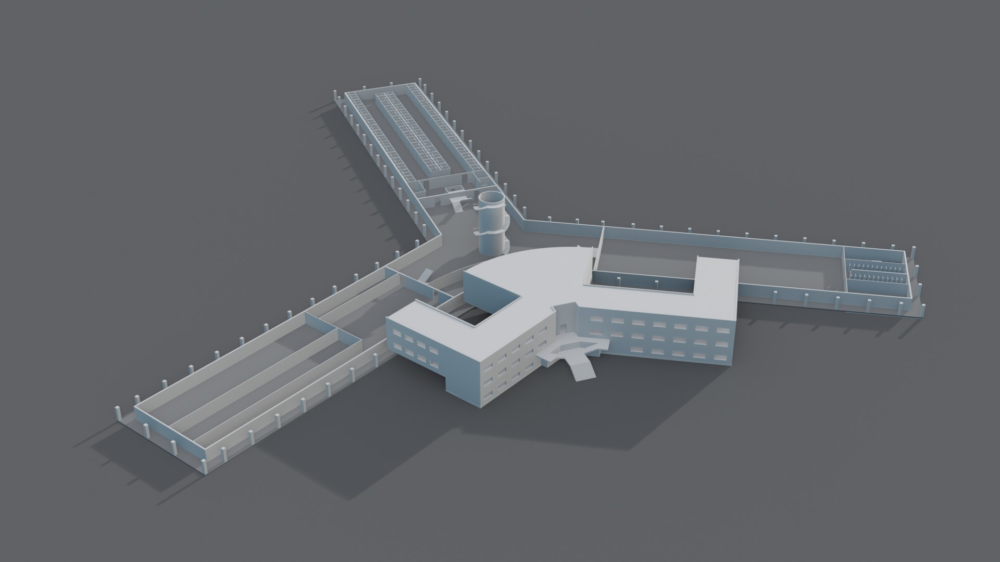

# 3D Files

This repository contains a collection of 3D models and other assets used in the Saydnaya Prison investigation.

In order to open these files you will need to download [Blender](https://www.blender.org/download/).

The table below outlines the models.

| File Name | Contents |
|---|---|
|**3D Models**|
| [SaydnayaPrison.blend](https://fa-public-assets.fra1.cdn.digitaloceanspaces.com/SaydnayaPrison/SaydnayaPrison.blend) | A 3D Model of Saydnaya Prison. |

## Saydnaya Prison

## 3rd Floor

## 2nd Floor

## 1st Floor

## Ground Floor
