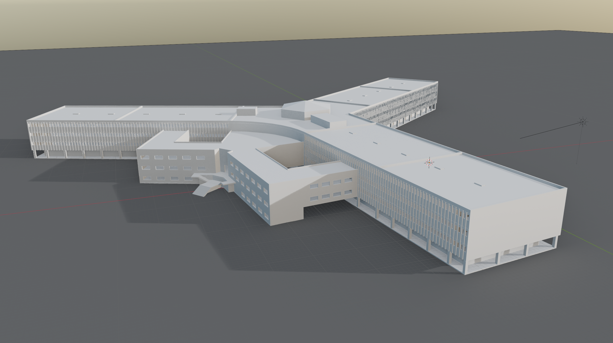

# 3D Files

This repository contains a collection of 3D models and other assets used in the Saydnaya Prison investigation.

In order to open these files you will need to download [Blender](https://www.blender.org/download/) and if you would like to use the .3dm files you will need [Rhino](https://www.rhino3d.com/).

The table below details the individual files.

| File Name | Contents |
|---|---|
|**3D Models**|
| [SaydnayaPrison.blend](https://fa-public-assets.fra1.cdn.digitaloceanspaces.com/SaydnayaPrison/SaydnayaPrison.blend) | A 3D Model of Saydnaya Prison. |
