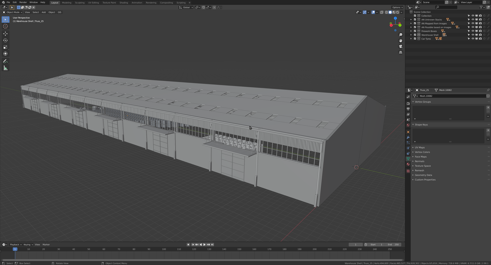

# 3D Files

This folder contains a collection of 3D models used in the Explosions on Beirut Port investigation.

| File Name | Contents |
|---|---|
|Blender|
| [Site.blend](https://www.) | The port of beirut and a large portion of the city as well as some of the camera locations where footage was captured. |
| [Clouds.blend](https://www.) | Objects that were housed inside including tyres, fireworks and bags of ammonium nitrate. |
| [Warehouse.blend](https://www.) | There are several different clouds and a blast representative of the envelope of the fire and explosion at different times. |
|Cinema4D|
| [Site and Clouds.c4d](https://www.) | The port of beirut and a large portion of the city as well as some of the camera locations where footage was captured and different clouds and a blast representative of the envelope of the fire and explosion at different times. |
| [Warehouse.c4d](https://www.) | There are several different clouds and a blast representative of the envelope of the fire and explosion at different times. |

In order to open the Blender files you will need to download [Blender](https://www.blender.org/download/).  You will need to download all the files into the same folder to use the Main Animation file.
In order to open the Cinema4D files you will need to download [Cinema4D](https://www.maxon.net/en/cinema-4d)

The model is split into several parts:
	1. The site and surrounding buildings.  This includes the port of beirut and a large portion of the city as well as some of the camera locations where footage was captured.
	2. The warehouse building.  This includes details of the objects that were housed inside including tyres, fireworks and bags of ammonium nitrate.
	3. The clouds created by the explosion.  There are several different clouds and a blast representative of the envelope of the fire and explosion at different times.

In the Blender folder the main model is 'Clouds.blend'.  Both the site the detailed model of the warehouse are referenced into this file.
In the Cinema4D folder the main model is 'Site and Clouds.c4d'.  The detailed model of the warehouse is referenced into this file.